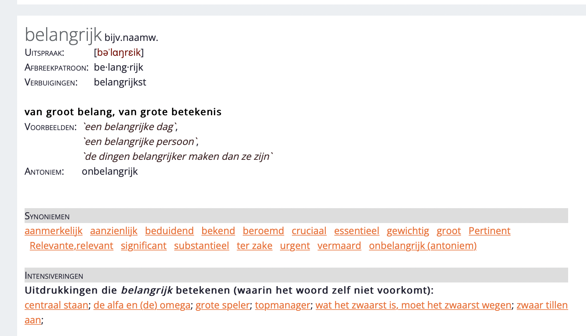

# Testing of the module - Manual and Unit tests

## Manual tests
### 1.1
Initiating an object of the class Word with an empty string should result in a RangeError: *Input must be between 1 and 35 characters long.*

### 1.2
Initiating an object of the class Word with a string of more than 35 characters should result in a RangeError: *Input must between 1 and 35 characters long.*

### 1.3
Initiating an object of the class Word with no input should result in a Error: *Input must be a String.*

### 1.4 
Initiating an object of the class Word with integer input should result in a Error: *Input must be a String.*

### 1.5 
Initiating an object of the class Word with the input 'belangrijk' should be silent. 

### 1.6
Initiating an object of the class Word with an input that is not a dutch word, or with a spelling that is not recognized as a dutch word should result in an Error: *There was no information about the chosen word, please check the spelling or make sure it is a dutch word.*

### 1.7 - Results from test 1
<table border="1" cellpadding="5">
  <tr>
    <th>Test</th>
    <th>Passed</th>
    <th>Comment</th>
  </tr>
  <tr>
    <th>1.1</th>
    <th>OK</th>
    <th>-</th>
  </tr>
    <tr>
    <th>1.2</th>
    <th>OK</th>
    <th>-</th>
  </tr>
    <tr>
    <th>1.3</th>
    <th>OK</th>
    <th>-</th>
  </tr>
    <tr>
    <th>1.4</th>
    <th>OK</th>
    <th>-</th>
  </tr>
    <tr>
    <th>1.5</th>
    <th>OK</th>
    <th>-</th>
  </tr>
    </tr>
  <tr>
    <th>1.6</th>
    <th>OK</th>
    <th>-</th>
  </tr>
</table>

## Test 2

### 2.1
Here, use the word *belangrijk* (*eng. important*). Search for the word at woorden.org to obtain the following info:

Compare the info presented on woorden.org with what the methods in the word class returns.

#### 2.1.1
Calling the method getWordInfo()
Should give the following result:

#### 2.1.2
Calling the method getSynonyms()
Should give the following result:

#### 2.1.3
Calling the method getAntonyms()
Should give the following result:

#### 2.1.3
Calling the method getExpressions()
Should give the following result:

### 2.2
The steps of comparison done in 2.1 are repeated for a list of different words, belonging to different categories. A successful test shows the same parameters as given on woorden.org. If a parameter for the word is not available at woorden.org, the method should return a message informing the user about this. This is also counted as a successful result.

This includes the longest word in the dutch language; *meervoudigepersoonlijkheidsstoornis* (*eng. multiple personelity disorder*) and the shortest; *o* (*eng. oh*). Beyond these, a verb; *springen* (*eng. to jump*), a noun; *paard* (*eng. horse*); a preposition; *op*
(*eng. on/in/up*) and an adjective; *groot* (*eng. big*) are chosen to be tested, on the basis of belonging to different categories.

<table border="1" cellpadding="5">
  <tr>
    <th>Word</th>
    <th>getWordInfo()</th>
    <th>getSynonyms()</th>
    <th>getAntonyms()</th>
    <th>getExpressions()</th>
    <th>Comment</th>
  </tr>
  <tr>
   <th>meervoudige- persoonlijkheids- stoornis</th>
   <th>OK</th>
   <th>OK</th>
   <th>OK</th>
   <th>OK</th>
   <th>woorden.org offers no expressions or synonyms/antonyms for this word. Only getWordInfo() actually resturns data.</th>
  </tr>
    <tr>
   <th>o</th>
   <th>OK</th>
   <th>OK</th>
   <th>OK</th>
   <th>OK</th>
   <th>Offers only wordInfo and synonyms, gives the proper information messages for other methods</th>
  </tr>
    <tr>
   <th>springen</th>
   <th>OK</th>
   <th>OK</th>
   <th>OK</th>
   <th>OK</th>
   <th>No antonyms available, correct message provided.</th>
  </tr>
    <tr>
   <th>paard</th>
   <th>OK</th>
   <th>OK</th>
   <th>OK</th>
   <th>OK</th>
   <th>No antonyms available, correct message provided.</th>
  </tr>
  <tr>
   <th>op</th>
   <th>OK</th>
   <th>OK</th>
   <th>OK</th>
   <th>OK</th>
   <th>Unusally, for this word, two antonyms are available, the method captures them both.</th>
  </tr>
  </tr>
    <tr>
   <th>groot</th>
   <th>OK</th>
   <th>OK</th>
   <th>OK</th>
   <th>OK</th>
   <th>Information available in all categories, everything was correctly presented</th>
  </tr>
</table>

## Comments for test 2
It is not possible to test for all existing words in the dutch language, but by choosing the two extremes (the first two words tested) and then a gruop of words, each belonging to a different category of words, a wide variety of words have been covered. For the rest, it can only be assumed that the underlying structure of woorden.org follows the same rules so that the methods written in this module have a chance of working correctly. It might very well be so, that for some words this structure will differ and then the methods will fail. They are tailored to extract information from a certain structure and should that structure change, the methods will break.

It can only be made sure that the methods returns the appropriate error when information is not found, This has been tested for both valid and invalid input.

## Unit tests
### Result

### Verbose

## Disclaimer
<h3 style="color:rgb(255, 140, 160)"> Just because the tests performed here all gave the expected result, that doesn't guarantee that it will work for every single word.</h3>